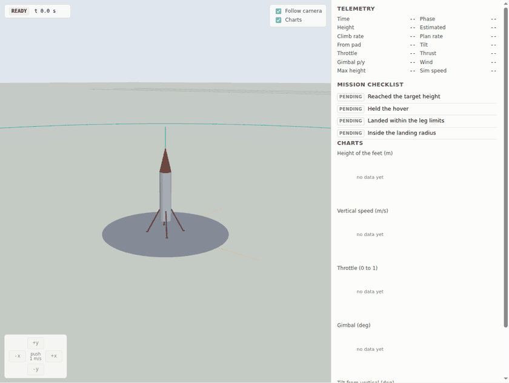
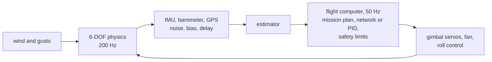
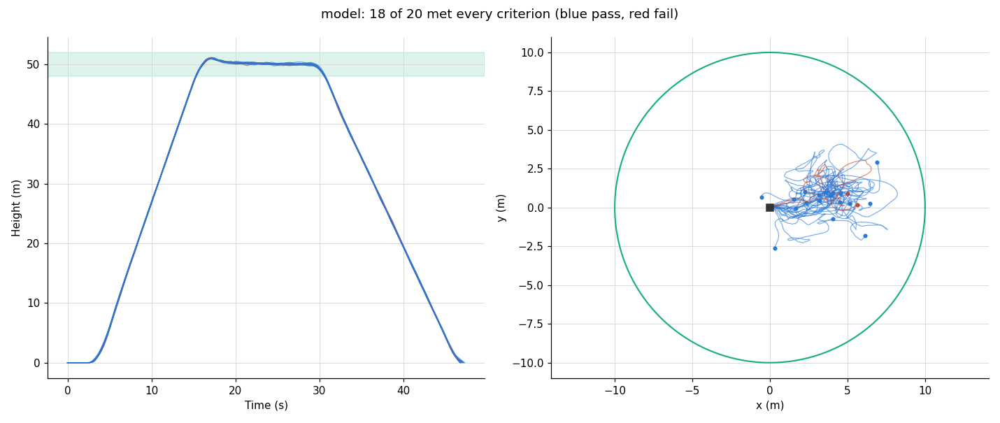
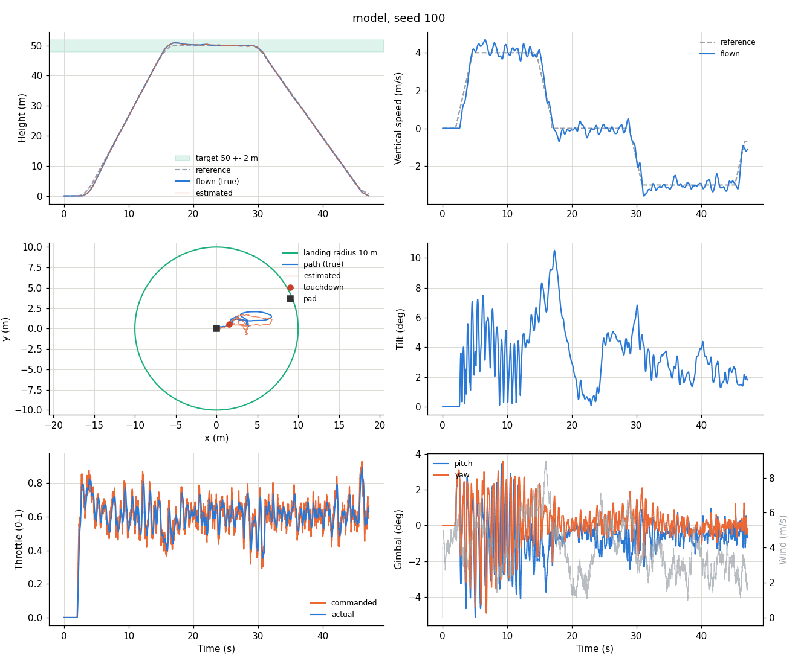
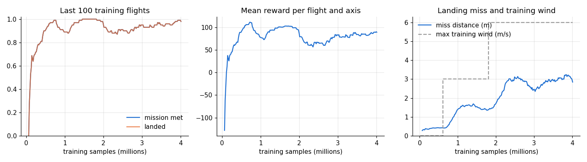
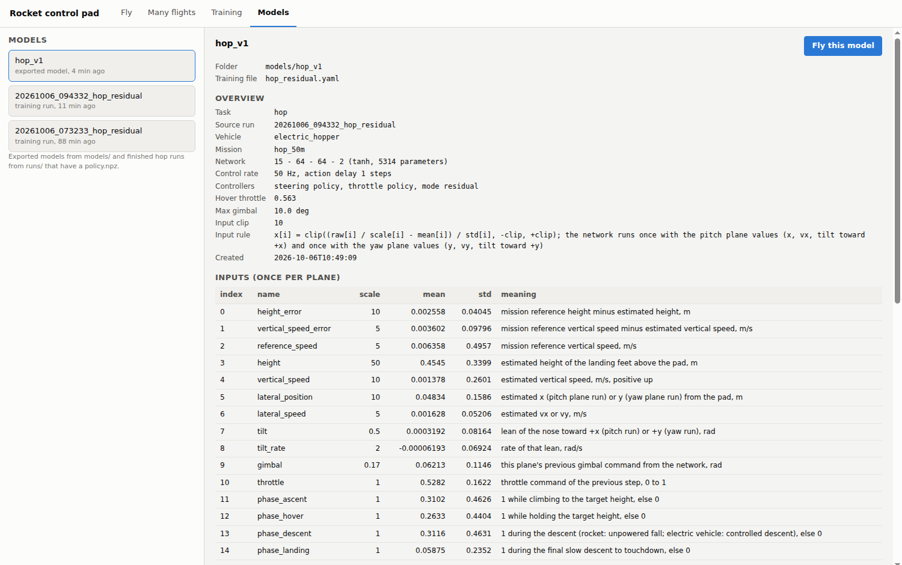

# Rocket landing simulator

Simulator, reinforcement learning and flight code for a small vertical take-off and landing test
vehicle. We train a neural network controller with PPO in a 6-DOF simulation, compare it with a
PID controller on the same flights, and export it to C and ONNX for the flight computer.



The current test vehicle is electric: a 90 mm ducted fan on a two-axis thrust vectoring gimbal,
with electric roll control. The mission is to climb to 50 m, hover for 10 s and land within 10 m
of the pad, with the controller flying from launch to touchdown. The same code also models a
solid-motor rocket with a drag brake and a landing motor ([docs/solid_rocket.md](docs/solid_rocket.md)).

**Every vehicle number in `configs/` is a placeholder until it is measured.** See [Your vehicle](#your-vehicle).

## How it works



- **Physics** ([rocketsim/physics.py](rocketsim/physics.py)): rigid body with quaternion attitude
  integrated with RK4 at 200 Hz; gravity, drag and side force from the wind, fan thrust with
  spin-up lag and reaction torque, and ground contact through the legs. The formulas are in
  [docs/physics.md](docs/physics.md).
- **Flight computer** ([rocketsim/hop/computer.py](rocketsim/hop/computer.py)): only sees the
  simulated sensors, never the true state. It follows the mission plan (climb, hover, descent,
  touchdown), runs the network or the PID, limits the commands and cuts the fan if the vehicle
  tilts too far or leaves the geofence. The same logic in C is in [firmware/hop/](firmware/hop/).
- **Network**: a small MLP (two hidden layers of 64). It runs once per axis, pitch and yaw, on
  15 inputs: errors against the mission plan, height and vertical speed, position and speed from
  the pad, tilt and tilt rate, the last commands and the flight phase. Each run gives a gimbal
  angle for its axis and a throttle vote; the two votes are averaged. In residual mode the outputs
  are corrections added to the PID, in direct mode the network flies alone.
- **Training** ([rocketsim/ppo.py](rocketsim/ppo.py), [scripts/train.py](scripts/train.py)): PPO
  with the clipped objective and GAE, written for this project in PyTorch. 32 flights are
  simulated at once on 16 processes. Every flight gets a different mission (10 to 60 m, 3 to 12 s
  hover), wind, gusts, sensor noise and hidden thrust and mass errors, and the wind gets stronger
  as training goes on.

[docs/architecture.md](docs/architecture.md) goes through the training loop in more detail.

## Results

The model in [models/hop_v1/](models/hop_v1/) was trained in residual mode (the network adds
corrections to the PID's commands) for 4 million samples, about an hour on 16 cores. It was then
flown 100 times against the PID alone, on the same seeds: the same gusts, sensor noise and hidden
thrust (+-8 %) and mass (+-80 g) errors.

| Wind | Network + PID | PID alone |
|---|---|---|
| 4 m/s, gusts 1.5 m/s | 95 / 100 | 99 / 100 |
| 6 m/s, gusts 1.5 m/s | 74 / 100 | 69 / 100 |

Every flight that touched down inside the leg limits also met the other three criteria, so all
failures are landings that were too fast, down or sideways. At 4 m/s the tuned PID alone is
slightly better; at 6 m/s, the strongest wind in training, the network helps. These are simulated
numbers for a placeholder vehicle, so they mean little until the data sheet is filled in and the
network is retrained for the real one.

```bash
python scripts/fly_mission.py --model models/hop_v1 --flights 100 --compare --hidden-errors --wind-mps 4 --gust-mps 1.5 --seed 1000 --no-plot   # about 15 minutes
```





## Quick start

Python 3.10 to 3.12.

```bash
python3 -m venv .venv
. .venv/bin/activate
pip install torch==2.5.1 --index-url https://download.pytorch.org/whl/cpu   # CPU build, much smaller
pip install -e ".[train,export,dev]"
pytest
```

Then:

```bash
python scripts/dashboard.py                      # control pad in the browser, http://127.0.0.1:8050
python scripts/fly_mission.py --plot --animate   # one mission flown by the PID, with plots and a 3D GIF
python scripts/fly_mission.py --model models/hop_v1 --wind-mps 4 --plot   # the same with the trained network
python scripts/train.py --training configs/training/hop_residual.yaml     # train your own
```

On a remote machine, forward port 8050 (VS Code does this from the Ports tab) and open the link on
your own computer.

## Your vehicle

Everything the simulator needs to know about the real vehicle goes into one fill-in sheet. The
printable list is [docs/electric_vehicle_data_request.pdf](docs/electric_vehicle_data_request.pdf);
[docs/vehicle_data_request.md](docs/vehicle_data_request.md) says how to measure each entry.

1. Copy `configs/datasheets/template.yaml` to `configs/datasheets/<your_name>.yaml`.
2. Fill in every entry marked `required`: masses, balance point, size, fan thrust and battery
   time, thrust vectoring, roll torque, legs, sensor rates and the mission (50 m, 10 s hover, 10 m
   landing circle). Optional entries already hold a working default.
3. Build the config files and check the vehicle:

   ```bash
   python scripts/build_vehicle.py configs/datasheets/<your_name>.yaml
   ```

   If entries contradict each other or ask for something the simulator cannot fly, it lists every
   entry to change and writes nothing. Otherwise it writes `configs/vehicles/<name>.yaml`,
   `configs/motors/<name>_motor.yaml`, `configs/sensors/<name>_sensors.yaml`,
   `configs/missions/<name>.yaml` and `configs/training/<name>.yaml`, works out the inertias and
   controller gains, and prints thrust to weight, hover throttle, gimbal authority, tip-over angle,
   battery time against the mission and any warnings.
4. Fly the mission with the PID, then train a network for this vehicle:

   ```bash
   python scripts/fly_mission.py --vehicle configs/vehicles/<name>.yaml --mission configs/missions/<name>.yaml --world configs/training/<name>.yaml
   python scripts/train.py --training configs/training/<name>.yaml
   ```

`configs/datasheets/example.yaml` holds the numbers of the example vehicle and rebuilds it.

## Where to change things

All settings live in YAML files; nothing in the code needs to change for a different vehicle,
mission or training setup.

| To change | Edit |
|---|---|
| Vehicle: mass, balance point, size, legs, gimbal limits, servos, roll control, PID gains, safety limits | `configs/vehicles/electric_hopper.yaml` |
| Motor: maximum thrust, spin-up time, battery time | `configs/motors/example_edf_90mm.yaml` |
| Sensors: IMU, barometer, GPS rates and noise | `configs/sensors/example_imu_gps.yaml` |
| Launch and landing: target height, climb and descent speeds, hover time, landing radius, pass criteria | `configs/missions/hop_50m.yaml` |
| Who flies (PID or the network, direct or residual) | `controllers` in the vehicle file, overridden by the training file |
| Training: what the network sees, rewards, randomisation, curriculum, network size | `configs/training/hop_residual.yaml` or `hop.yaml` |
| How many flights are simulated at once | `ppo.n_sims` (flights) and `ppo.workers` (processes) in the training file |
| Simulation rate, wind for test flights, launch site | `simulation`, `wind`, `environment` in the training file |
| Plots and animation after training | `evaluation.plots` and `evaluation.animation` in the training file |

Units are in the key names (`_mm`, `_g`, `_deg`, `_s`, `_mps`) and are converted on load. Unknown
keys and out-of-range values stop with a message that names the file and the key. Frames and sign
conventions: [docs/conventions.md](docs/conventions.md).

## Dashboard

`python scripts/dashboard.py` starts a local web page with four tabs:

- **Fly**: launch a live flight with the PID or any trained model and watch it in 3D, with charts
  of height, speed, throttle, gimbal and tilt against the mission plan. Set wind, gusts, thrust and
  mass errors, sensor noise and the mission targets before launch; change the wind or push the
  vehicle sideways during the flight. The charts can be switched off.
- **Many flights**: fly the same setup on many seeds in parallel, optionally against the PID, and
  see the success rate and every path from above.
- **Training**: progress of every training run, updating while it trains, and a form to start a
  new one.
- **Models**: every trained model with its inputs, outputs and evaluation; fly it with one click.

## Flying missions from the command line

```bash
python scripts/fly_mission.py                                   # PID, calm air, plots on
python scripts/fly_mission.py --model models/hop_v1 --wind-mps 4 --gust-mps 1.5 --animate
python scripts/fly_mission.py --model models/hop_v1 --flights 50 --compare --hidden-errors
python scripts/fly_mission.py --no-plot                         # numbers only
```

Each flight writes a CSV log with the sensor readings, estimates, true state, commands and the
mission plan (`runs/flights/` by default). `--plot` (on by default) draws inputs, outputs and the
plan; `--animate` writes a 3D GIF; `--flights N` flies N seeds and prints how many met every
mission criterion. For existing logs: `scripts/plot_flight.py`, `scripts/animate_flight.py` and
`scripts/bundle_viewer.py` (a single HTML file with a 3D viewer).

## Training

```bash
python scripts/train.py --training configs/training/hop_residual.yaml   # network corrects the PID
python scripts/train.py --training configs/training/hop.yaml            # network flies alone
```

A run writes `runs/<date>_<time>_<name>/`: `progress.csv` (one row per PPO update),
`policy.npz` (saved every `ppo.checkpoint_every` samples, so it can be flown before training
ends), `model.pt` (network, optimizer and normaliser state) and copies of every config used. At
the end the network is published to `models/<run>/` and flown against the PID on the same seeds.
The 4 million sample residual run takes about an hour on 16 cores.



## Trained models and the flight computer

`models/<name>/` holds everything needed to fly a model: `policy.npz` (simulator), `policy.onnx`
(any ONNX runtime), `policy_weights.h`, `policy_config.h` and `hop_params.h` (C), `model.json`
(every input and output described, check results, evaluation) and the configs it was trained with.
[models/hop_v1/](models/hop_v1/) is the model shown above; the Models tab of the dashboard lists
what each input means:



`firmware/` has the C99 controller that runs the network, the mission plan, the PID fallback and
the safety limits on the board. It is checked against the Python flight computer on whole
simulated flights. Wiring it into the flight software, the input format and a checklist for the
first flights: [docs/hardware_integration.md](docs/hardware_integration.md).

```bash
python scripts/export_policy.py runs/<run> --name hop_v2 --evaluate --install
cd firmware && make   # desktop build of the controller and its checks
```

## Repository layout

```
configs/      vehicles, motors, sensors, missions, data sheets, rockets, training files
rocketsim/    simulator, flight computers, PPO, training environments, export   (rocketsim/hop: electric vehicle)
scripts/      command line tools
dashboard/    browser front end of scripts/dashboard.py
firmware/     C99 code for the flight computer and its desktop checks
models/       trained models
docs/         architecture, conventions, physics, hardware integration, data sheets
tests/        pytest suite
```

## Status

- Electric vehicle: simulator, mission plan, PID, training, evaluation, model export and the C
  controller work. All vehicle numbers are placeholders until the data sheet is filled in.
- Solid rocket: simulator, landing burn design tool, PID and a trained landing policy
  ([docs/solid_rocket.md](docs/solid_rocket.md)).
- Not modelled yet: ground effect near the pad, battery voltage sag, fan inflow in a side wind
  beyond a constant side-force coefficient, servo backlash.
- Next: fill in the data sheet for the real vehicle and retrain on it, then work on the
  touchdown, where every failed flight in the results above went wrong.

## License

MIT, see [LICENSE](LICENSE).
