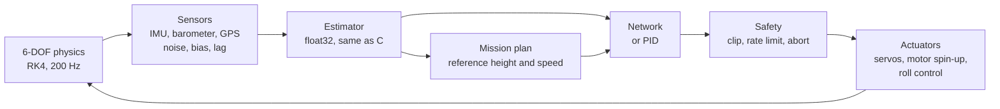
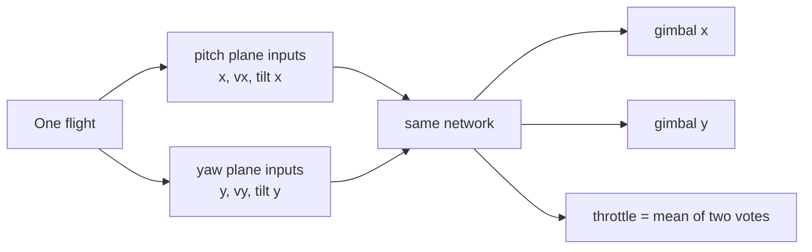

# Architecture

The project simulates a vehicle, its sensors and its flight computer, trains a neural network
controller for it with reinforcement learning, and exports that network for the real flight
computer. Two vehicles share the same code:

| Vehicle | Files | What the controller does |
|---|---|---|
| Electric test vehicle (ducted fan with thrust vectoring and electric roll control) | `configs/vehicles/electric_hopper.yaml`, `configs/missions/hop_50m.yaml`, `rocketsim/hop/` | Flies the whole mission: launch, climb to the target height, hover, descend, land inside the landing radius |
| Solid-motor rocket with a drag brake and a solid landing motor | `configs/rockets/example_tvc.yaml`, `rocketsim/` | Steers the landing burn; the boost is flown by a PID and a stopping-distance table lights the landing motor |

## Simulation loop

Every flight runs the same closed loop. Physics integrates at 200 Hz; the flight computer runs at
the control rate in the vehicle file (50 Hz), and its command is applied one control step later.

The network only sees what the real board will see: the estimator's output, not the true state.

## Where the network and PPO are

- **Network**: two separate fully connected networks, built by Stable-Baselines3's `ActorCriticPolicy`.
  The actor decides the commands and is the only part that is exported; the critic estimates the
  expected return and exists only during training. Sizes are set in the training file
  (`ppo.hidden_layers`: 64 x 64 tanh for the electric vehicle, 32 x 32 for the rocket).
- **PPO**: Stable-Baselines3 `PPO`, created in `scripts/train.py`. It is not reimplemented here.
- **Environment**: `rocketsim/hop/env.py` (electric vehicle) and `rocketsim/env.py` (rocket) turn one
  simulated flight into an episode; `rocketsim/vecenv.py` runs many flights at once in worker processes.
- **After training**: the actor's weights and the input normalisation are written to
  `runs/<run>/policy.npz` and published as a model folder in `models/<run>/` (see
  [hardware_integration.md](hardware_integration.md)).

## One network, two planes

The vehicle is round, so pitch and yaw follow the same equations. The network is written for one
plane and runs twice per control step: once with the x values (position, speed, tilt toward +x)
and once with the y values. It outputs a gimbal command for that plane and a throttle vote; the
two votes are averaged. During training each flight therefore gives two samples per step, and
the trained network runs the same way on the board.

## What the electric vehicle's network sees and does

Inputs, per plane, each divided by the scale in `configs/training/hop.yaml` and then normalised
with the training statistics:

| Input | Meaning |
|---|---|
| height_error, vertical_speed_error | how far the vehicle is from the mission's reference height and vertical speed |
| reference_speed | where the plan is heading |
| height, vertical_speed | estimated feet height and vertical speed |
| lateral_position, lateral_speed | distance and speed from the pad in this plane |
| tilt, tilt_rate | lean toward this plane's axis and its rate |
| gimbal, throttle | the previous commands |
| phase_ascent, phase_hover, phase_descent, phase_landing | which part of the mission it is in |

Outputs, per plane, in [-1, 1]: the gimbal command (times the gimbal limit) and a throttle vote.
Throttle = hover throttle / cos(tilt) + mean vote x `action.throttle_range`. In residual mode
(`controllers.mode: residual`) both outputs are instead small corrections added to the PID's
commands. The PID always runs in parallel and takes over for any step in which the network gives
an invalid number.

## How it is trained

- **Episodes**: one flight from the pad to touchdown, abort or time limit.
- **Rewards** (`rewards` in the training file): small penalties every step for being off the
  reference height and speed, for sideways distance and speed, tilt, and actuator movement; at the
  end a bonus for landing inside the leg limits, a larger bonus when every mission criterion is
  met, and a large penalty for a crash, an abort or running out of time.
- **Randomisation**: every flight draws a different thrust (+-8 %), dry mass (+-80 g), wind speed
  and direction, gusts, sensor noise and bias, and a different mission (target height 10 to 60 m,
  hover 3 to 12 s), so the network follows whatever the mission file says.
- **Curriculum** (`curriculum`): calm air and low noise first, then wind up to 3 m/s, then up to 6 m/s.
- **Scale** (`ppo`): `n_sims` flights simulated at once, spread over `workers` processes. Each
  update uses `n_sims x 2 x n_steps` samples. About 450 to 750 samples per second on one shared
  workstation.
- **Baseline**: every model is flown against the PID on the same seeds after training
  (`evaluation` in the training file); the comparison is stored with the model.

## Mission criteria

`configs/missions/hop_50m.yaml` sets the plan and the pass criteria: reach the target height
within `altitude_tolerance_m`, stay inside that band for `hover.time_s`, touch down inside the
leg limits of the vehicle file, and within `landing_radius_m` of the pad. `MissionScore` in
`rocketsim/hop/mission.py` grades every flight against the true state.

## Code map

| Path | Contents |
|---|---|
| `rocketsim/physics.py`, `aero.py`, `quaternion.py`, `touchdown.py` | 6-DOF dynamics, air, attitude maths, ground contact |
| `rocketsim/motors.py` | solid motor curves (.eng, YAML) and electric motors |
| `rocketsim/sensors.py`, `estimator.py` | IMU, barometer and GPS models; the float32 estimator |
| `rocketsim/actuators.py` | servos, motor spin-up, roll control, igniters, brake |
| `rocketsim/hop/` | electric vehicle: vehicle file, mission plan, flight computer, simulation, training env, rewards, evaluation, plots, C headers |
| `rocketsim/env.py`, `vecenv.py`, `observation.py`, `curriculum.py`, `policy.py` | training environment pieces shared by both vehicles |
| `rocketsim/export.py`, `modelpack.py` | C and ONNX export, model folders |
| `rocketsim/dashboard/`, `dashboard/` | the browser dashboard |
| `firmware/` | C99 controller code for the board, with desktop checks |
| `scripts/` | command line tools: train, fly, evaluate, export, dashboard, plots, animation |
